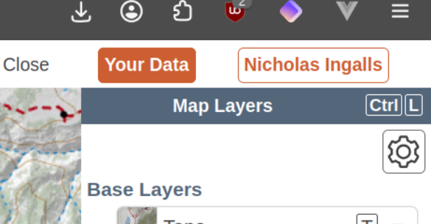
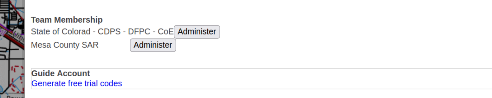
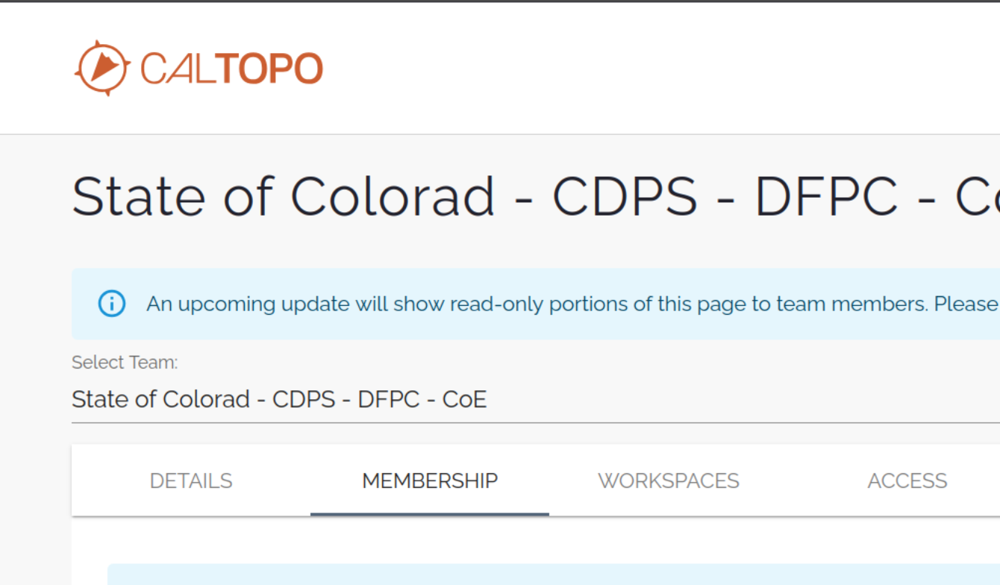
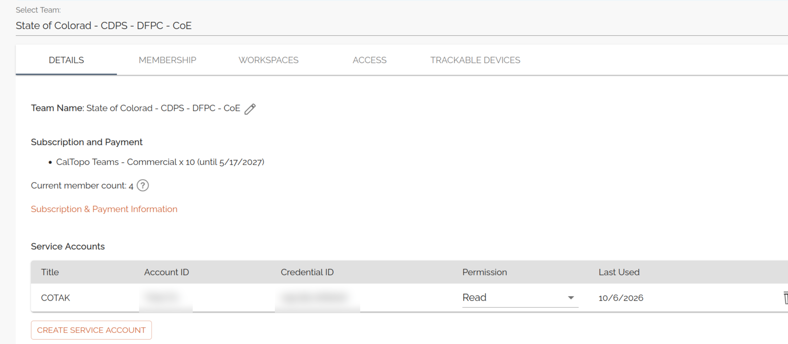

<h1 align='center'>ETL-CalTopo</h1>

<p align='center'>Bring CALTopo Maps into the TAK System</p>

## Team Access Token

The `Team Account` mode requires a Service Account Credential ID and Secret from CalTopo.
You must be an admin of the CalTopo Team to create an access token.

1. Login to [CalTopo](https://caltopo.com) and click your username in the top bar

<p align='center'></p>

2. In the popup, under Team Membership, click `Administer` for the team account you wish to configure

<p align='center'></p>

3. On the Team page, click the `Details` tab

<p align='center'></p>

4. Under Service Accounts, click `Create Service Account` and create a new Service Account with at minimum `Read` permissions

<p align='center'></p>

## Development

DFPC provided Lambda ETLs are currently all written in [NodeJS](https://nodejs.org/en) through the use of a AWS Lambda optimized
Docker container. Documentation for the Dockerfile can be found in the [AWS Help Center](https://docs.aws.amazon.com/lambda/latest/dg/images-create.html)

```sh
npm install
```

Add a .env file in the root directory that gives the ETL script the necessary variables to communicate with a local ETL server.
When the ETL is deployed the `ETL_API` and `ETL_LAYER` variables will be provided by the Lambda Environment

```json
{
    "ETL_API": "http://localhost:5001",
    "ETL_LAYER": "19"
}
```

To run the task, ensure the local [CloudTAK](https://github.com/dfpc-coe/CloudTAK/) server is running and then run with typescript runtime
or build to JS and run natively with node

```
ts-node task.ts
```

```
npm run build
cp .env dist/
node dist/task.js
```

### Deployment

Deployment into the CloudTAK environment for configuration is done via automatic releases to the DFPC AWS environment.

Github actions will build and push docker releases on every version tag which can then be automatically configured via the 
CloudTAK API.

Non-DFPC users will need to setup their own docker => ECS build system via something like Github Actions or AWS Codebuild.

